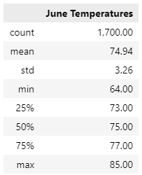
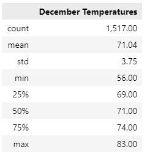

# Oahu Weather Analysis for June and December

## Overview

We are seeking investor funding for our surf and ice cream shop in Oahu, Hawaii.  Below we provide weather information from a weather observations database to help our investors make a more informed decision.  Our database includes temperatures from January 2010 through mid-August 2017.  For this analysis, we'll look at statistics for the months of June and December.

## Analysis

Below are statistics from June and December calculated from the observation database.

 

When looking at the two months during summer and winter, we can observe 

- June and December statistics do not vary a lot between the months.  
  - Average temperature is only about 4 degrees different with June at 75 degrees and December at 71 degrees.
  - Maximum temperatures in the month only vary by 2 degrees with June at 85 and December at 83.
- Temperature variability in December is higher with a standard deviation of 3.75 vs the June deviation of 3.26.
- December's lowest temperature is 8 degrees lower than June's which, with the standard deviation, indicates that there is lower lows in the month.

## Summary

Overall, we can see that the high and average temperatures do not vary a lot of variability between the two months.  We have more observations in June but feel that the 1500 in December is still a good sample size.  We would recommend running analysis of precipitation for these same months to determine how much they differ. Due to the changing of the climate, we would also recommend viewing how the statistics are changing year over year for these months.  There may be increasing temperatures and/or variability due to climate change that we need to factor in.
